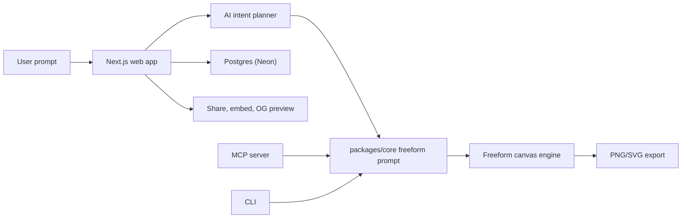

# drawstack

drawstack is an AI-powered architecture and diagram studio for turning plain-language prompts into polished diagrams, charts, architecture maps, process models, and shareable exports.

[Live app](https://drawxyz.vercel.app) · [Repository](https://github.com/gwaghmar/drawstack)


## What It Does

- Builds directly on one AI-native canvas — flowcharts, dashboards, org charts, timelines, network diagrams, treemaps, icon posters, and more, all in the same editable scene graph (not a collection of separate diagram-type integrations).
- Exports exact-size PNG and SVG assets for docs, decks, social posts, and embeds.
- Saves projects with revision history, public share links, iframe embeds, and real Open Graph previews.
- Supports multi-provider AI through OpenAI, Anthropic, Google, Groq, and Mistral.
- Includes Auth.js (via Supabase), Postgres persistence (via Neon), Stripe billing, API keys, and an MCP server for agent workflows.

## Architecture

The app is a pnpm monorepo with a Next.js web app, shared diagram logic, a CLI package, and an MCP server.



Source lives in [`docs/assets/flowstudio-architecture.mmd`](docs/assets/flowstudio-architecture.mmd) — kept in sync with the fence above.
The rendered `docs/assets/flowstudio-architecture.svg` linked at the top of this file predates the 2026-08-17 single-engine pivot and has not been regenerated (no mermaid renderer available in this environment) — it still shows the old multi-engine shape. Text sources are current; the image is not.

## Tech Stack

- Next.js 16 App Router, React 19, TypeScript, Tailwind CSS
- Drizzle ORM on Postgres (Neon); Auth.js via a separate Supabase project
- Vercel AI SDK with OpenAI, Anthropic, Google, Groq, and Mistral providers
- Konva + roughjs + perfect-freehand for the freeform canvas; Yjs + y-webrtc (self-hosted signaling) for multiplayer
- pnpm workspaces with `apps/web`, `packages/core`, `packages/cli`, and `packages/mcp-server`

## Quick Start

```bash
pnpm install
cp .env.example apps/web/.env.local
pnpm --filter @flowchart/web db:push
pnpm dev
```

Open `http://localhost:3040`.

For local development without Postgres, set `MOCK_DB=true` in `apps/web/.env.local`.

## Environment

Copy `.env.example` to `apps/web/.env.local` and configure the values you need:

- `DATABASE_URL` for Postgres (Neon)
- `AUTH_SECRET` for Auth.js
- `NEXT_PUBLIC_SUPABASE_URL` and `NEXT_PUBLIC_SUPABASE_ANON_KEY` for production auth
- At least one hosted AI provider key, such as `OPENAI_API_KEY` or `GOOGLE_GENERATIVE_AI_API_KEY`
- Stripe values if billing is enabled

## Scripts

```bash
pnpm dev          # run the web app
pnpm build        # build core and web packages
pnpm lint         # run workspace lint tasks
pnpm test:unit    # run Node unit tests
pnpm test         # run Playwright tests
pnpm mcp:dev      # run the MCP server
```

## Deploy

1. Import the repository into Vercel.
2. Set the Vercel root directory to `apps/web`.
3. Add the production environment variables from `.env.example`.
4. Connect a Postgres database (Neon) for `DATABASE_URL` and a separate Supabase project for Auth.js, then run `pnpm --filter @flowchart/web db:push` (see `CLAUDE.md` — this command currently has a known issue against this project's RLS setup; `db:generate` + manual apply is the fallback).

## Project Status

drawstack has shipped the core editor, AI generation, save/share/embed workflows, brand kit support, templates, real OG previews, and the agent-native freeform canvas (replacing tldraw). As of 2026-08-17 the product is a single engine — every other diagram type that used to exist (Mermaid, Excalidraw, ReactFlow, ECharts, Nivo, BPMN, cloud/ERD/orgchart, D3, Cytoscape, vis-network, Fabric, PixiJS, and 12 social-card types) was deliberately removed in favor of one AI-native canvas that covers the same ground and more. See `docs/planning/freeform-canvas-engine-plan.md` and `CLAUDE.md` for full design and current architecture.
